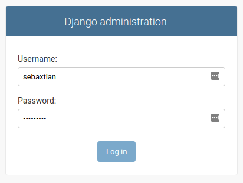

# weather-api

This is an example of Weather API, the weather data is collected from [Open Weather Map](https://openweathermap.org/)

---

> Work in progress ...

## Roadmap

- [x] ~~Add Project Description~~
- [ ] Add About the Project
- [x] ~~Requirements~~
- [x] ~~Create and Setup Virtual Environment~~
- [x] ~~Install Requeriments~~
- [x] ~~Setup Environment Variables~~
- [x] ~~Run Migrations~~
- [ ] Python Unit Testing
- [x] ~~Run the Project Locally~~
- [ ] Create Admin User
- [ ] Login Django Admin Site
- [ ] Postman API Documentation
- [ ] Run Automated Testing with Postman
- [ ] Getting Started Video

---

## About the Project

`About the Project Here`

## Requirements

In order to run the project locally, you will need the following requeriments:

- Linux Debian/Ubuntu, Ubuntu 18.04.5 LTS^
- Python 3.8^
- curl 7.58.0^
- libpq-dev
- Heroku CLI

## Create and Setup Virtual Environment

Run the instructions below in a terminal to create and setup the Python virtual environment:

```bash
# Linux terminal
python -m venv .venv
source .venv/bin/activate
```

## Install Requeriments

- PostgreSQL library

```bash
# Linux terminal
sudo apt install libpq-dev
```

- Heroku CLI

```bash
# Linux terminal
curl https://cli-assets.heroku.com/install.sh | sh
```

- Python project requirements

```bash
# Linux terminal
pip install -r requirements.txt
```

## Setup Environment Variables

```bash
# Linux terminal
cp -fv example.env .env
```

After copy the example.env file to .env you can edit and change the values in the .env file, by default you can use the same file.

## Run Migrations

```bash
# Within api/ folder run in a terminal
python manage.py makemigrations
python manage.py migrate
```

## Python Unit Testing

`Python Unit Testing Here`

## Run the Project Locally

Now the project is available to run locally, running a terminal:

```bash
# Run the app locally
heroku local web
```

Then open [http://localhost:5000/admin](http://localhost:5000/admin) in your browser.

## Create Admin User

Django Admin Site needs an Admin User,
read the documentation [here](https://docs.djangoproject.com/en/3.0/intro/tutorial02/#creating-an-admin-user)

```bash
# Within api/ folder run in a terminal
python manage.py createsuperuser
# ---
Username: sebaxtian
Email address: sebaxtian@example.com
Password: **********
Password (again): *********
Superuser created successfully.
```

Remember this admin user will be used by the Django Admin Site.

## Login Django Admin Site

Open the browser and go to:

> [http://localhost:5000/admin](http://localhost:5000/admin)

Use the Admin username and password to Login into the Django Admin Site.

[](./Login-Admin-Site.png)

## Postman API Documentation

Read and review the Weather API Documentation in Postman:

[Weather API Documentation](#!)

## Run Automated Testing with Postman

`Run Automated Testing with Postman Here`

## Getting Started Video

`Getting Started Video Here`
